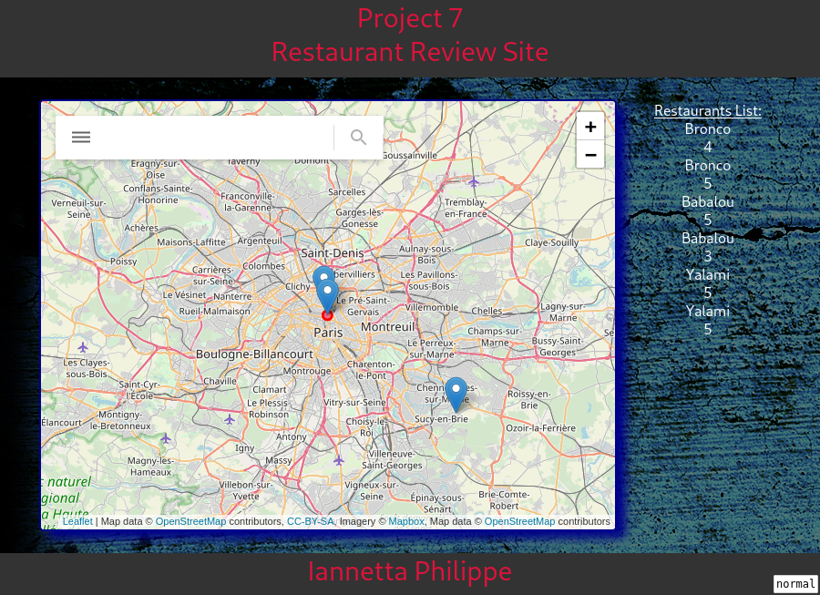

# Project 7 ©Iannetta Philippe 

## STEP 1: RESTAURANTS

	1. Get user's location with leaflet geoloc [done]

	2. Specific color marker on that location  [done]

	3. Put focus on user's location [done]

	4. If restaurants aren't visible, don't put them in the menu.
   else show them in the menu 
   	* Use setInterval (if true, else false)
   	* Re-organize menu : no need to have a menu on the right of the webage;
   use the one on the left of the map.

	5. When you click on a restaurant, show its google street view photo

	6. Show its number of stars and reviews

## STEP 2: ADD RESTAURANTS AND REVIEWS

	7. Add a review to existing restaurants / create a form, essentially

	8. Create a new restaurant when clicking on the map
[not necessary to keep the info after user leaves the page]

## STEP 3: INTEGRATION WITH GOOGLE PLACES API

	9. Find an API to retrieve restaurants and reviews! 
Use it to display additional restaurants and reviews 
on your map so you don't have to use only your JSON file. 

## HOW TO RUN MY APP :

* ON LINUX : 

	1. Clone this repository wherever you see fit on your machine

	2. Install npm (node package manager)

	3. Run npm install http-server

	4. Run http-server in "OC P7" directory. Then type localhost:8080 in your browser.
That's it, your done. 

	5. Enjoy !

* ON WINDOWS :

	Come on, let's be serious for a second. Install Linux.

* ON MAC :

	No different than Linux.
